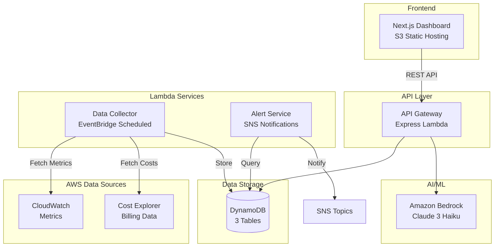

# ☁️ CloudOps Intelligence Platform

<div align="center">

**A comprehensive cloud monitoring and cost optimization SaaS platform showcasing senior-level full-stack engineering and cloud architecture**

[](https://github.com/DanteTuraSalvador/cloudops-intelligence-platform/actions/workflows/ci.yml)
[](https://github.com/DanteTuraSalvador/cloudops-intelligence-platform/actions/workflows/cd.yml)
[](https://www.typescriptlang.org/)
[](https://nodejs.org/)
[](https://nextjs.org/)
[](https://aws.amazon.com/)

[Live Demo](http://cloudops-dashboard-695210052357.s3-website-ap-southeast-2.amazonaws.com) • [API Docs](#api-documentation) • [Architecture](#architecture)

</div>

---

## 📋 Table of Contents

- [Overview](#overview)
- [Key Features](#key-features)
- [Architecture](#architecture)
- [Technology Stack](#technology-stack)
- [AWS Services](#aws-services)
- [Getting Started](#getting-started)
- [Deployment](#deployment)
- [CI/CD Pipeline](#cicd-pipeline)
- [API Documentation](#api-documentation)
- [Project Structure](#project-structure)
- [Development](#development)
- [Contributing](#contributing)
- [License](#license)

---

## 🎯 Overview

CloudOps Intelligence Platform is a portfolio project demonstrating cloud engineering capabilities including:

- **Serverless Microservices**: 3 Lambda functions (API Gateway, Data Collector, Alert Service) with event-driven design
- **Real AWS Integration**: CloudWatch metrics collection and Cost Explorer billing data with mock fallback for local development
- **AI-Powered Insights**: Amazon Bedrock (Claude 3 Haiku) for intelligent cost optimization recommendations
- **Modern Frontend**: Next.js dashboard with real-time data visualization
- **Production Deployment**: Automated deployment scripts, DynamoDB storage, S3 hosting
- **CI/CD Pipeline**: GitHub Actions with automated testing and security scanning

**Note**: Additional services (Cost Analyzer, Anomaly Detector in C#) are in development but not yet integrated with the main application.

**Target Audience**: This is a portfolio project showcasing cloud architecture, full-stack development, and AWS expertise for technical interviews and employment opportunities.

---

## ✨ Key Features

### 🤖 AI-Powered Insights
- **Amazon Bedrock Integration**: Leverages Claude 3 Haiku for intelligent cost optimization recommendations
- **Real-time Analysis**: Analyzes cost trends and provides actionable savings opportunities
- **Natural Language Insights**: Human-readable explanations of complex cloud spending patterns

### 📊 Real-time Cloud Monitoring
- **Metrics Collection**: Automated polling of AWS CloudWatch APIs for infrastructure health
- **Cost Tracking**: Integration with AWS Cost Explorer for billing analysis
- **Alert System**: SNS-based notifications for anomalies, budget thresholds, and recommendations
- **Interactive Dashboard**: Next.js frontend with real-time data visualization using Recharts

### 🔍 Advanced Analytics
- **Cost Forecasting**: Predictive modeling using historical data (C# ML.NET)
- **Anomaly Detection**: Statistical analysis to identify unusual patterns (C# service)
- **Resource Optimization**: Right-sizing recommendations based on actual usage
- **Multi-Account Support**: Designed for multi-tenant cloud monitoring

### 🚀 Production-Ready
- **Serverless-First**: Minimize operational overhead with Lambda, ECS Fargate
- **Event-Driven**: Loose coupling via EventBridge, SQS, SNS
- **Infrastructure as Code**: AWS CDK (TypeScript) for repeatable deployments
- **CI/CD Automation**: GitHub Actions pipelines for testing and deployment
- **Security by Design**: IAM least privilege, encryption at rest/transit, secrets management

---

## 🏗️ Architecture

### High-Level Architecture



**Note**: Cost Analyzer and Anomaly Detector services exist in the codebase (C# .NET) but are not yet integrated with the main application.

### Event Flow

1. **Data Collection**: EventBridge triggers Data Collector Lambda every 5 minutes
2. **Metrics Ingestion**: Collector fetches CloudWatch metrics → stores in DynamoDB
3. **Cost Analysis**: Cost Analyzer processes billing data → generates forecasts
4. **Anomaly Detection**: Detector analyzes patterns → creates alerts
5. **AI Insights**: Bedrock analyzes cost data → provides optimization recommendations
6. **User Interface**: Dashboard fetches data via API Gateway → visualizes insights

---

## 💻 Technology Stack

### Backend Services (Lambda Functions)

| Service | Language | Framework | Port | Purpose | Status |
|---------|----------|-----------|------|---------|--------|
| **API Gateway** | TypeScript | Express.js | 3001 | REST API for frontend | ✅ Deployed |
| **Data Collector** | TypeScript | Node.js | 3003 | Metrics & cost collection from CloudWatch/Cost Explorer | ✅ Deployed |
| **Alert Service** | TypeScript | Node.js | 3004 | Alert management & SNS notifications | ✅ Deployed |
| **Cost Analyzer** | C# | .NET 8 | 3002 | Cost forecasting & analysis | 🚧 In Development |
| **Anomaly Detector** | C# | .NET 8 | 3005 | Statistical anomaly detection (Z-score algorithm) | 🚧 In Development |

**Note**: C# services have working code but are not yet integrated with the TypeScript services or deployed to AWS.

### Frontend

- **Framework**: Next.js 15 (React 19)
- **Styling**: Tailwind CSS 3.4
- **State Management**: Zustand
- **Charts**: Recharts 2.12
- **Build**: Static export for S3 hosting

### Infrastructure

- **IaC**: AWS CDK v2 (TypeScript)
- **Package Manager**: pnpm 9.15 (monorepo)
- **Containerization**: Docker + Docker Compose
- **Testing**: Vitest 2.0 (TypeScript), xUnit (.NET)
- **Linting**: ESLint 9, Prettier 3.7
- **CI/CD**: GitHub Actions

---

## ☁️ AWS Services

### Deployed & Configured ✅

**Compute**
- **Lambda**: 3 serverless functions
  - API Gateway (Express REST API)
  - Data Collector (CloudWatch/Cost Explorer integration)
  - Alert Service (SNS notifications)
- **EC2**: t3.micro instance (for AWS credit demonstration)

**Storage**
- **DynamoDB**: 3 tables for hot data storage
  - `cloudops-metrics` (infrastructure metrics)
  - `cloudops-costs` (billing data)
  - `cloudops-alerts` (alert records)
- **S3**: Static website hosting for Next.js frontend
- **RDS PostgreSQL**: db.t3.micro (for AWS credit demonstration)

**AI/ML**
- **Amazon Bedrock**: Claude 3 Haiku model for cost insights generation

**Networking & API**
- **API Gateway**: HTTP API for REST endpoints

**Data Sources**
- **CloudWatch**: Metrics collection (real integration with mock fallback)
- **Cost Explorer**: Billing data (real integration with mock fallback)

**Security & IAM**
- **IAM**: Roles and policies for Lambda execution
- **KMS**: Default encryption for DynamoDB/S3

### Planned / Not Implemented 🚧

- **ECS/Fargate**: C# services not deployed
- **CloudFront**: CDN not configured
- **X-Ray**: Distributed tracing not enabled
- **EventBridge**: Schedules defined but not active
- **SNS/SQS**: Topics/queues created but not fully wired
- **VPC**: Not configured (using default)
- **Athena/Glue**: Data lake not implemented

---

## 🚀 Getting Started

### Prerequisites

- **Node.js**: v22.x or higher
- **pnpm**: v8 or higher (`npm install -g pnpm`)
- **.NET SDK**: 8.0.x (for C# services)
- **Docker**: Latest version (for local development)
- **AWS CLI**: v2 (for deployment)
- **AWS Account**: With appropriate IAM permissions

### Installation

1. **Clone the repository**
   ```bash
   git clone https://github.com/DanteTuraSalvador/cloudops-intelligence-platform.git
   cd cloudops-intelligence-platform
   ```

2. **Install dependencies**
   ```bash
   pnpm install
   ```

3. **Set up environment variables**
   ```bash
   cp .env.example .env.local
   ```

   Edit `.env.local` with your AWS credentials:
   ```env
   AWS_REGION=ap-southeast-2
   AWS_ACCESS_KEY_ID=your_access_key
   AWS_SECRET_ACCESS_KEY=your_secret_key
   DYNAMODB_ENDPOINT=http://localhost:8000  # For local dev
   USE_MOCK_DATA=true  # Use mock data locally
   ```

4. **Start local services**
   ```bash
   docker-compose up -d
   ```

   This starts:
   - DynamoDB Local (port 8000)
   - Redis (port 6379)
   - LocalStack (AWS services emulation)
   - All microservices

5. **Build all services**
   ```bash
   pnpm build
   ```

6. **Run the dashboard**
   ```bash
   pnpm --filter @cloudops/dashboard dev
   ```

   Open [http://localhost:3000](http://localhost:3000)

### Quick Start (Development)

```bash
# Install dependencies
pnpm install

# Start all services in development mode
pnpm dev

# Run tests
pnpm test

# Lint code
pnpm lint

# Build for production
pnpm build
```

---

## 🔧 Development Modes

### Mock Data vs Real AWS Integration

The platform supports two modes for local development:

#### Mock Data Mode (Default for Local Development)

Set `USE_MOCK_DATA=true` in your `.env.local` file:

```env
USE_MOCK_DATA=true
```

**What works offline:**
- ✅ Dashboard displays mock metrics and costs
- ✅ All API endpoints return sample data
- ✅ Full UI/UX testing without AWS credentials
- ✅ Local DynamoDB with mock data
- ✅ Bedrock AI falls back to hardcoded recommendations

**Perfect for:**
- Frontend development
- UI/UX testing
- Demos without AWS credentials
- Local development without AWS costs

#### Real AWS Integration Mode

Set `USE_MOCK_DATA=false` and provide AWS credentials:

```env
USE_MOCK_DATA=false
AWS_REGION=ap-southeast-2
AWS_ACCESS_KEY_ID=your_access_key_here
AWS_SECRET_ACCESS_KEY=your_secret_key_here
```

**What requires AWS credentials:**
- ✅ Real CloudWatch metrics collection
- ✅ Real Cost Explorer billing data
- ✅ Amazon Bedrock AI insights (requires Anthropic model access approval)
- ✅ DynamoDB data storage (can use local or AWS)
- ✅ SNS alert notifications

**Note**: Real AWS integration may incur small costs (~$0.10-$1.00/month) depending on usage.

### Environment Variables Reference

| Variable | Required | Default | Purpose |
|----------|----------|---------|---------|
| `USE_MOCK_DATA` | No | `true` | Enable/disable mock data mode |
| `AWS_REGION` | Yes (for AWS) | `ap-southeast-2` | AWS region |
| `AWS_ACCESS_KEY_ID` | Yes (for AWS) | - | AWS credentials |
| `AWS_SECRET_ACCESS_KEY` | Yes (for AWS) | - | AWS credentials |
| `DYNAMODB_ENDPOINT` | No | - | Local DynamoDB URL (e.g., `http://localhost:8000`) |
| `NEXT_PUBLIC_API_URL` | No | `http://localhost:3001` | API Gateway URL for frontend |

---

## 🚢 Deployment

### Option 1: Automated Deployment (Recommended)

The project includes comprehensive deployment scripts in the `deployment/` directory.

#### Deploy to AWS

```bash
# 1. Set AWS credentials
export AWS_REGION=ap-southeast-2
export AWS_ACCESS_KEY_ID=your_access_key
export AWS_SECRET_ACCESS_KEY=your_secret_key

# 2. Run deployment script
cd deployment
./deploy.sh  # Linux/Mac
# or
.\deploy.ps1  # Windows PowerShell
```

This script will:
- ✅ Create IAM roles and policies
- ✅ Deploy 3 Lambda functions
- ✅ Create API Gateway HTTP API
- ✅ Provision DynamoDB tables
- ✅ Deploy frontend to S3
- ✅ Set up EventBridge schedules
- ✅ Configure CloudWatch dashboards

#### Individual Component Deployment

```powershell
# Deploy Lambda functions
.\deployment\deploy-lambdas.ps1

# Deploy frontend to S3
.\deployment\deploy-frontend.ps1

# Create DynamoDB tables
.\deployment\create-alerts-table.ps1

# Create EC2 instance
.\deployment\create-ec2.ps1

# Create RDS database
.\deployment\create-rds.ps1
```

### Option 2: AWS CDK Deployment

```bash
# Install AWS CDK CLI
npm install -g aws-cdk

# Bootstrap CDK (first time only)
cd infrastructure/cdk
cdk bootstrap

# Deploy all stacks
cdk deploy --all

# Deploy specific stack
cdk deploy CloudOpsApiStack
```

### Option 3: Manual Deployment via AWS Console

See [deployment/DEPLOYMENT_GUIDE.txt](deployment/DEPLOYMENT_GUIDE.txt) for step-by-step manual deployment instructions.

---

## 🔄 CI/CD Pipeline

### GitHub Actions Workflows

The project uses GitHub Actions for continuous integration and deployment:

#### CI Pipeline ([.github/workflows/ci.yml](.github/workflows/ci.yml))

Triggered on push to `main` or `develop` branches:

- ✅ **Lint & Type Check**: ESLint + TypeScript validation
- ✅ **Test TypeScript Services**: Vitest unit tests with DynamoDB container
- ✅ **Test C# Services**: xUnit tests for .NET services
- ✅ **Build Frontend**: Next.js static export
- ✅ **Docker Build**: Build containers for all 5 services
- ✅ **Security Scan**: Trivy vulnerability scanning

#### CD Pipeline ([.github/workflows/cd.yml](.github/workflows/cd.yml))

Automated deployment to AWS (requires AWS credentials in GitHub Secrets):

- 🚀 **Deploy to Dev**: Automatic on `develop` branch
- 🚀 **Deploy to Staging**: After dev deployment succeeds
- 🚀 **Deploy to Production**: Manual approval + `main` branch only

#### Security Workflow ([.github/workflows/security.yml](.github/workflows/security.yml))

- 🔒 Dependency scanning (Dependabot)
- 🔒 CodeQL analysis
- 🔒 Trivy container scanning
- 🔒 SARIF upload to GitHub Security tab

### Pipeline Status

All pipelines are **passing** ✅

View live status: [GitHub Actions](https://github.com/DanteTuraSalvador/cloudops-intelligence-platform/actions)

---

## 📚 API Documentation

### Base URL

- **Production**: `https://b8c2okv3l5.execute-api.ap-southeast-2.amazonaws.com`
- **Local**: `http://localhost:3001`

### Endpoints

#### Health Check
```http
GET /health
```
Returns service health status.

#### Metrics
```http
GET /api/v1/metrics?accountId={accountId}&metricType={type}&startTime={iso}&endTime={iso}
```
Fetch infrastructure metrics (CPU, Memory, Network, Disk).

**Query Parameters:**
- `accountId`: AWS account identifier
- `metricType`: `CPUUtilization` | `MemoryUtilization` | `NetworkIn` | `NetworkOut` | `DiskOps`
- `startTime`: ISO 8601 timestamp
- `endTime`: ISO 8601 timestamp

#### Costs
```http
GET /api/v1/costs?accountId={accountId}&startDate={date}&endDate={date}
```
Retrieve cost data with service breakdown.

**Query Parameters:**
- `accountId`: AWS account identifier
- `startDate`: YYYY-MM-DD format
- `endDate`: YYYY-MM-DD format

#### AI Insights
```http
GET /api/v1/insights
```
Get AI-powered cost optimization recommendations from Amazon Bedrock.

**Response Example:**
```json
{
  "success": true,
  "data": {
    "insights": "The cost data shows high EC2 spending...",
    "recommendations": [
      "Optimize EC2 instances by right-sizing...",
      "Review RDS database instances...",
      "Implement S3 lifecycle policies..."
    ],
    "generatedAt": "2026-01-01T04:29:14.135Z",
    "model": "Claude 3 Haiku (Bedrock)"
  }
}
```

For complete API documentation, see [docs/api/](docs/api/).

---

## 📁 Project Structure

```
cloudops-intelligence-platform/
├── .github/
│   └── workflows/              # CI/CD pipelines
│       ├── ci.yml              # Build & test
│       ├── cd.yml              # Deployment
│       └── security.yml        # Security scanning
├── deployment/                 # AWS deployment scripts
│   ├── iam-policies/           # IAM policy definitions
│   ├── deploy.sh               # Main deployment script
│   ├── deploy-lambdas.ps1      # Lambda deployment
│   ├── create-ec2.ps1          # EC2 provisioning
│   └── create-rds.ps1          # RDS setup
├── docs/                       # Documentation
│   ├── architecture/           # Architecture Decision Records (ADRs)
│   ├── api/                    # API documentation
│   └── runbooks/               # Operational runbooks
├── frontend/
│   └── dashboard/              # Next.js React dashboard
│       ├── src/
│       │   ├── app/            # Pages (metrics, costs, alerts, insights)
│       │   ├── components/     # Reusable components
│       │   └── lib/            # API client, utilities
│       └── public/             # Static assets
├── infrastructure/
│   └── cdk/                    # AWS CDK Infrastructure as Code
│       ├── lib/
│       │   ├── api-stack.ts    # API Gateway, Lambda, DynamoDB
│       │   ├── storage-stack.ts # S3, data persistence
│       │   ├── frontend-stack.ts # CloudFront, S3 hosting
│       │   └── monitoring-stack.ts # CloudWatch, X-Ray
│       └── bin/
│           └── app.ts          # CDK app entry point
├── packages/                   # Shared packages (monorepo)
│   ├── types/                  # Shared TypeScript types
│   └── utils/                  # Shared utilities (logger, validators)
├── services/
│   ├── api-gateway/            # Express REST API (TypeScript)
│   ├── data-collector/         # Metrics & cost collection (TypeScript)
│   ├── alert-service/          # Alert management (TypeScript)
│   ├── cost-analyzer/          # Cost forecasting (C# .NET)
│   └── anomaly-detector/       # Anomaly detection (C# .NET)
├── tests/                      # Test suites
│   ├── unit/                   # Unit tests
│   ├── integration/            # Integration tests
│   └── e2e/                    # End-to-end tests
├── docker-compose.yml          # Local development environment
├── pnpm-workspace.yaml         # Monorepo configuration
├── package.json                # Root package config
└── README.md                   # This file
```

---

## 🛠️ Development

### Running Individual Services

```bash
# API Gateway
pnpm --filter @cloudops/api-gateway dev

# Data Collector
pnpm --filter @cloudops/data-collector dev

# Alert Service
pnpm --filter @cloudops/alert-service dev

# Frontend Dashboard
pnpm --filter @cloudops/dashboard dev

# Cost Analyzer (.NET)
cd services/cost-analyzer
dotnet run

# Anomaly Detector (.NET)
cd services/anomaly-detector
dotnet run
```

### Testing

```bash
# Run all tests
pnpm test

# Run tests with coverage
pnpm test:coverage

# Run specific service tests
pnpm --filter @cloudops/api-gateway test

# Run .NET tests
cd services/cost-analyzer
dotnet test
```

### Linting & Formatting

```bash
# Lint all code
pnpm lint

# Fix linting issues
pnpm lint:fix

# Format code
pnpm format
```

### Database Operations

```bash
# Create DynamoDB tables locally
node scripts/create-tables.cjs

# Check DynamoDB data
.\deployment\check-dynamodb.ps1

# Show database contents
.\deployment\show-db-data.ps1
```

### Troubleshooting

#### Issue: Lambda functions return 502 errors
**Solution**: Check CloudWatch logs
```bash
.\deployment\check-logs.ps1
```

#### Issue: Frontend shows 404 for routes
**Solution**: Ensure `trailingSlash: true` in `next.config.ts` for S3 hosting

#### Issue: DynamoDB connection errors
**Solution**: Verify `DYNAMODB_ENDPOINT` environment variable
```bash
# Local development
export DYNAMODB_ENDPOINT=http://localhost:8000

# AWS deployment (remove or comment out)
# DYNAMODB_ENDPOINT should not be set
```

#### Issue: Bedrock access denied
**Solution**: Submit use case details in AWS Console (Bedrock → Model access → Anthropic)

---

## 🎓 Learning Outcomes

This project demonstrates proficiency in:

### Cloud Architecture
- ✅ Serverless design patterns (Lambda, API Gateway)
- ✅ Event-driven architecture (EventBridge, SNS, SQS)
- ✅ Multi-tier application design
- ✅ Microservices decomposition
- ✅ Infrastructure as Code (AWS CDK)

### Full-Stack Development
- ✅ TypeScript + Node.js backend services
- ✅ C# .NET for compute-intensive workloads
- ✅ React + Next.js modern frontend
- ✅ RESTful API design
- ✅ Real-time data visualization

### DevOps & CI/CD
- ✅ GitHub Actions pipeline automation
- ✅ Docker containerization
- ✅ Multi-stage deployments (dev/staging/prod)
- ✅ Automated testing strategies
- ✅ Security scanning integration

### AWS Services
- ✅ Compute: Lambda, ECS, EC2
- ✅ Storage: S3, DynamoDB, RDS
- ✅ AI/ML: Amazon Bedrock (Claude 3)
- ✅ Monitoring: CloudWatch, X-Ray
- ✅ Networking: VPC, API Gateway, CloudFront

### Production Concerns
- ✅ Observability (logging, tracing, metrics)
- ✅ Error handling and resilience
- ✅ Security best practices (IAM, encryption)
- ✅ Cost optimization
- ✅ Scalability and performance

---

## 🌐 Live Demo

- **Dashboard**: [http://cloudops-dashboard-695210052357.s3-website-ap-southeast-2.amazonaws.com](http://cloudops-dashboard-695210052357.s3-website-ap-southeast-2.amazonaws.com)
- **API Health**: [https://b8c2okv3l5.execute-api.ap-southeast-2.amazonaws.com/health](https://b8c2okv3l5.execute-api.ap-southeast-2.amazonaws.com/health)
- **AI Insights API**: [https://b8c2okv3l5.execute-api.ap-southeast-2.amazonaws.com/api/v1/insights](https://b8c2okv3l5.execute-api.ap-southeast-2.amazonaws.com/api/v1/insights)

**Note**: Demo uses mock data for metrics. Real AWS integration requires your own AWS credentials.

---

## 🤝 Contributing

This is a portfolio project, but contributions are welcome! Please follow these guidelines:

1. Fork the repository
2. Create a feature branch (`git checkout -b feature/amazing-feature`)
3. Commit changes using conventional commits (`git commit -m 'feat: add amazing feature'`)
4. Push to the branch (`git push origin feature/amazing-feature`)
5. Open a Pull Request

### Code Standards

- Follow existing code style (enforced by ESLint + Prettier)
- Write unit tests for new features
- Update documentation as needed
- Ensure all CI checks pass

---

## 📄 License

This project is licensed under the MIT License - see the [LICENSE](LICENSE) file for details.

---

## 🚀 Future Enhancements

The following features are planned or in development:

### Near Term
- **Complete C# Services Integration**: Wire up Cost Analyzer and Anomaly Detector to TypeScript services
- **EventBridge Scheduling**: Activate automated data collection triggers
- **SNS Alert Delivery**: Complete end-to-end alert notification workflow
- **Frontend Enhancements**: Add more interactive charts and data filtering
- **Test Coverage**: Increase unit test coverage to 90%+

### Medium Term
- **X-Ray Distributed Tracing**: Add observability across all Lambda functions
- **CloudFront CDN**: Deploy frontend via CloudFront for global distribution
- **User Authentication**: Implement AWS Cognito for multi-user support
- **Role-Based Access Control (RBAC)**: Admin vs viewer permissions
- **Real-time WebSocket Updates**: Push notifications for new alerts

### Long Term
- **Kinesis Data Streams**: Real-time event processing pipeline
- **Step Functions**: Complex workflow orchestration for cost analysis
- **Athena + Glue Data Lake**: Historical analytics on S3
- **Multi-Cloud Support**: Extend to Azure and GCP metrics collection
- **ML-Based Forecasting**: Advanced cost prediction using SageMaker
- **Custom Dashboards**: User-configurable widgets and views

### Nice to Have
- **Mobile App**: React Native mobile dashboard
- **Slack/Teams Integration**: Alert notifications via chat platforms
- **Cost Recommendations API**: Marketplace API for third-party integrations
- **Export/Reporting**: PDF/CSV reports for executive summaries

**Contributions Welcome**: Feel free to pick up any of these enhancements and submit a PR!

---

## 👤 Author

**Dante Tura Salvador**

- GitHub: [@DanteTuraSalvador](https://github.com/DanteTuraSalvador)
- LinkedIn: [Your LinkedIn](https://www.linkedin.com/in/your-profile) _(update with your profile)_
- Portfolio: [Your Portfolio](https://your-portfolio.com) _(update with your portfolio)_

---

## 🙏 Acknowledgments

- **Amazon Bedrock**: AI-powered insights using Claude 3 Haiku
- **AWS Free Tier**: Enabling cost-effective cloud experimentation
- **Next.js Team**: Excellent React framework
- **Recharts**: Beautiful data visualization library
- **Anthropic**: Claude AI models

---

## 📊 Project Stats

- **Languages**: TypeScript (primary), C# (.NET), CSS/Tailwind
- **Deployed Services**: 3 Lambda functions + Next.js frontend
- **In Development**: 2 C# .NET services
- **AWS Resources**: 10+ services (Lambda, DynamoDB, S3, API Gateway, Bedrock, etc.)
- **Lines of Code**: ~12,000+ (TypeScript/C#/React)
- **Test Coverage**: Unit tests with Vitest (TypeScript) and xUnit (C#)
- **CI/CD**: GitHub Actions (all checks passing ✅)
- **Deployment Time**: ~5 minutes (automated scripts)

---

<div align="center">

**⭐ Star this repo if you find it helpful!**

**📧 Questions? Open an issue or reach out on LinkedIn**

Built with ❤️ using AWS, TypeScript, and modern cloud architecture patterns

</div>
